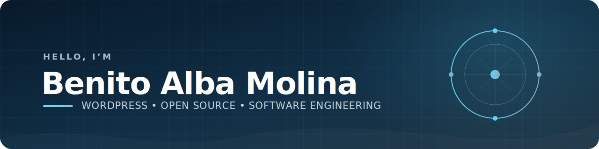

  

 

I’m a software engineer focused on WordPress, WooCommerce, and the open web. I build and improve plugins and web applications with PHP, JavaScript, and React, tracing problems across application logic, background processing, APIs, data, and user-facing behavior. I care about performance, accessibility, compatibility, maintainable abstractions, and changes that are easy to review and verify.

## Engineering focus

- Building and maintaining WordPress plugins across PHP, JavaScript, React, REST APIs, background processing, and data layers
- Debugging complex problems across user interfaces, application logic, background jobs, integrations, and databases
- Improving performance through careful measurement while preserving backward compatibility
- Building accessible interfaces with semantic HTML, ARIA, WCAG-informed testing, and assistive-technology verification
- Making focused, reviewable changes supported by PHPUnit, Jest, static analysis, coding standards, and continuous integration
- Evaluating abstraction, data-access, and implementation trade-offs with long-term maintainability in mind
- Using AI-assisted workflows for codebase research, debugging, test planning, and automation while independently validating the resulting code and technical decisions
- Contributing to open-source products through clear documentation, code review, and asynchronous collaboration

## Languages and tools

  
  
  
  
  
  
  
  
  
  
  
  
  
  
  
  
  
  

## Open-source contributions

[Browse all of my public pull requests →](https://github.com/search?q=is%3Apr+author%3Abenitoalba+sort%3Aupdated-desc&type=pullrequests)

## How I work

> Trace the full problem, measure what matters, make the smallest reliable change, and verify the behavior users depend on.

I value useful impact, continuous learning, open source, and clear asynchronous communication. I take initiative and prefer small, well-explained improvements that balance performance, accessibility, compatibility, and maintainability while remaining easy to review and safe to ship. I share context so others can understand, question, and build on the work.
